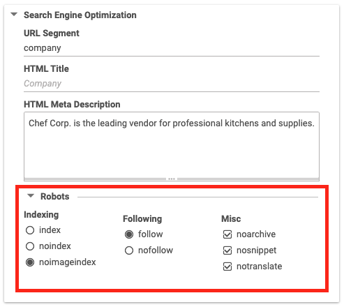

# Robots Meta Tag
Support editors configuring the `<meta name="robots">` tag directly in Studio.

For more information visit:
- [Google Developers - Robots meta tag, data-nosnippet, and X-Robots-Tag specifications](https://developers.google.com/search/docs/advanced/robots/robots_meta_tag?hl=en#robotsmeta)
- [MDN Web Docs - The metadata element](https://developer.mozilla.org/en-US/docs/Web/HTML/Element/meta)

## Studio
Allows to configure crawler aka "Robots" options directly in the SEO property group of each page.


## Frontend

Use the SEO tag in your templates.

```ftl
<#-- @ftlvariable name="self" type="com.coremedia.blueprint.common.contentbeans.Page" -->
...
<#-- SEO: Directly render robots tag ... -->
${seo.robotsMetaTag(page)}

<#-- SEO: ... or use the list of configured options if you want to do custom processing. -->
<meta name="robots" content="${seoRobotsOpts?join(", ")}" />
```
